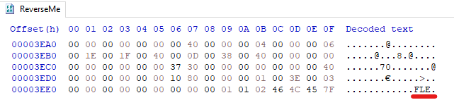
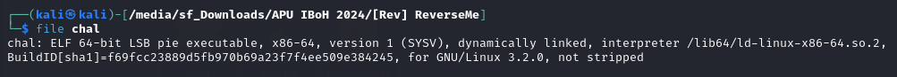
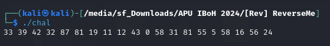
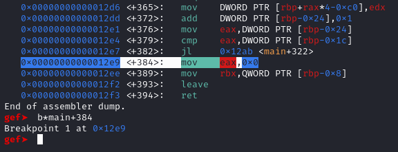
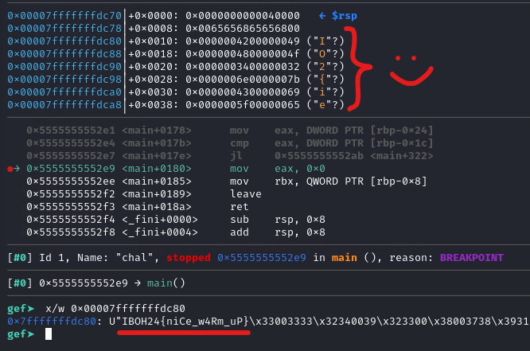

# [Rev] ReverseMe

## ✨ Walkthrough

The file given is actually an ELF file but the content of it was reversed.



So, write a Python script to reverse it back to normal.

```python
def reverse_binary_file(input_file, output_file):
    with open(input_file, 'rb') as f:
        content = f.read()

    content = content[::-1]

    with open(output_file, 'wb') as f:
        f.write(content)

input_file = 'ReverseMe'
output_file = 'chal'

reverse_binary_file(input_file, output_file)
```



Unfortunately, it will display out *nonsense number* when we execute the binary. 



Let's take a look at the `main` function using [Ghidra](https://ghidra-sre.org/).

```c
undefined8 main(void)

{
  int iVar1;
  int iVar2;
  undefined4 local_cf;
  undefined auStack_cb [83];
  undefined8 local_78;
  undefined8 local_70;
  undefined8 local_68;
  undefined8 local_60;
  undefined8 local_58;
  undefined2 local_50;
  undefined6 uStack_4e;
  undefined2 uStack_48;
  undefined8 local_46;
  int local_30;
  int j;
  int i;
  int count;
  char *local_20;
  
  local_78 = 0x3234203933203333;
  local_70 = 0x3820373820323320;
  local_68 = 0x2031312039312031;
  local_60 = 0x2030203334203231;
  local_58 = 0x3138203133203835;
  local_50 = 0x3520;
  uStack_4e = 0x383520352035;
  uStack_48 = 0x3120;
  local_46 = 0x34322036352036;
  local_20 = strtok((char *)&local_78," ");
  count = 0;
  while (iVar1 = count, local_20 != (char *)0x0) {
    count = count + 1;
    iVar2 = atoi(local_20);
    *(int *)(auStack_cb + (long)iVar1 * 4 + 3) = iVar2;
    local_20 = strtok((char *)0x0," ");
  }
  for (i = 0; i < count; i = i + 1) {
    printf("%d ",(ulong)*(uint *)(auStack_cb + (long)i * 4 + 3));
  }
  putchar(10);
  local_cf = 0x68656568;
  auStack_cb._0_4_ = CONCAT13(auStack_cb[3],0x6565);
  local_30 = 6;
  for (j = 0; j < count; j = j + 1) {
    *(uint *)(auStack_cb + (long)j * 4 + 3) =
         *(uint *)(auStack_cb + (long)j * 4 + 3) ^ (int)(char)auStack_cb[(long)(j % local_30) + -4];
  }
  return 0;
}
```

We could see that there are **3 *interesting* loops** inside the `main` function. However, take a look at the **last loop** before the `return` statement.

```c
local_30 = 6;
for (j = 0; j < count; j = j + 1) {
*(uint *)(auStack_cb + (long)j * 4 + 3) =
     *(uint *)(auStack_cb + (long)j * 4 + 3) ^ (int)(char)auStack_cb[(long)(j % local_30) + -4];
}
```

There is XOR operation happening inside the loop. That said, let's debug the binary with gdb and analyse it by using the command `disas main`. Place a breakpoint after the loop and run it.



Some part of the flag can be found inside the stack itself. So, inspect the stack using the command `x/w 0x00007fffffffdc80`.



## 🏳️ Flag

`IBOH24{niCe_w4Rm_uP}`