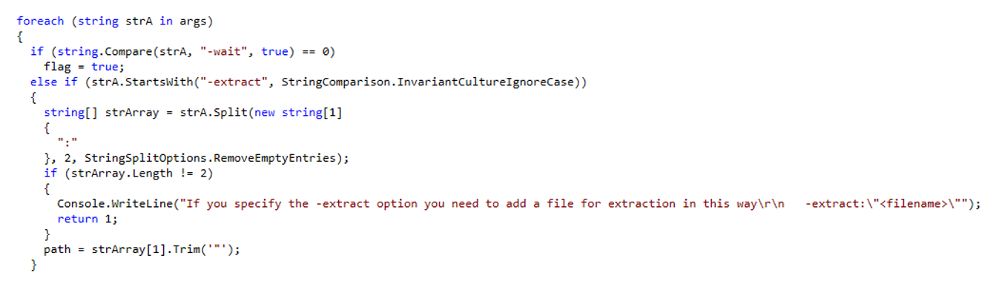

# [Malware Analysis] Just a normal EXE 

## 📚 Overview

> *"One of our clients reported the presence of a file named "normal.exe" in their TEMP folder. They mentioned that this executable file sometimes runs automatically. Can you help them discover what this executable file does? md5 hash of file "file.tar.gz" : 933e754be6c8366d3b4e020080dbad00"*

## ✨ Walkthrough

When the programme executed in Windows command prompt, it will give an output which is similar to the command net user. Since the .EXE file is written in .NET, decompile it using [dotPeek](https://www.jetbrains.com/decompiler/) and after that, navigate to **normal (msil) > ModuleNameSpace > MainApp**.

It can be seen that the programme also take arguments, allowing the users to extract the information into a file. So, let’s create a file named output and then execute the programme using command `normal -extract:"output"` in cmd.

Once the execution done, a *suspicious* array of char 👀 (*and also other bunch of stuffs*) appeared inside the file. That said, copy all the values and then convert it into ASCII characters. Turns out it is a link leading to the s3cr3t5.txt, which is the flag.

## 🏳️ Flag

`ihack24{obFusCat!on_Alw4ys_w0rK}`