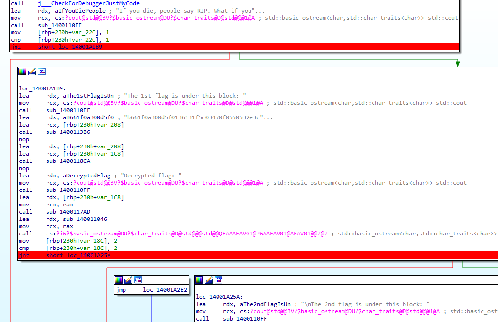

# [Rev] RestInPeace 🩸

## 📚 Overview

> *"On average, there are 170,790 deaths per day. What if you can just be like \"sike, imma set my rest in peace day to another time\""*

## ✨ Walkthrough

Given .EXE file written in C++ ... when we run the programme, it will display out this message and no sign of flag *sobsob*. 

```
C:\Users\Hp\Downloads>RestInPeace.exe
If you die, people say RIP. What if you uno reverse card the people, and set the RIP to someone else?
```

That said, let's boot up the [IDA](https://hex-rays.com/ida-free) to disassemble and debug the programme.



We can see that it printing out the message we've seen before in the terminal. Besides that, we could observe instructions which will display the flag but the programme didn't execute it, instead jump to another *block* lmao ...  What to do? Insert breakpoints, debug the programme, and change the RIP (*Instruction Pointer*). As simple as that. 

## 🏳️ Flag

`SHCTF24{n0b0dy_c4n_dr46_m3_d0wn_1337}`