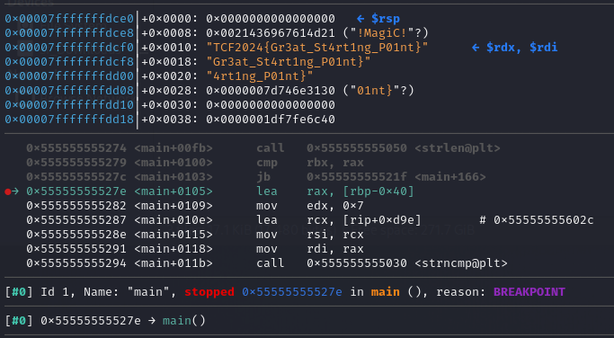

# [Rev] Key Checker

## 📚 Overview

> *"Flag Checkers are too common, what about Key Checker?"*

## ✨ Walkthrough

Given .ELF binary that is written in C language, the programme will **only validate the key**. The **correct key can be used to decrypt** the encrypted flag.  

In this case, let's use [Ghidra](https://ghidra-sre.org/) to analyse the binary and navigate to the `main` function.


We could see that the **value of encrypted flag** located inside the `main()` function itself.  

The programme **check for the length of the key**, From that, we know that the actual length is 7.

Next, the programme will **perform the XOR operation** between the `encrypted flag` and the `key`.  

Lastly, the programme will check if the **first 7 characters of the flag string** is equal to `TCF2024` or not.

## ⚙ Solution

Let's perform XOR operation to get the key, `First 7 chars of flag` ⊕ `TCF2024` = `!MagiC!`

```python
enc_flag = [0x75, 0x0e, 0x27, 0x55, 0x59, 0x71, 0x15, 0x5a, 0x0a, 0x13, 0x54, 0x08, 0x37, 0x7e, 0x72, 0x39, 0x55, 0x15, 0x1d, 0x72, 0x4f, 0x46, 0x12, 0x31, 0x57, 0x58, 0x2d, 0x55, 0x5c]
key = "!MagiC!"
    
flag = ''.join(chr(enc_flag[i] ^ ord(key[i % len(key)])) for i in range(len(enc_flag)))

print(flag)
```

*Alternative: debug the binary using gdb, enter the correct key, and observe the result in registers.*



## 🏳️ Flag

`TCF2024{Gr3at_St4rt1ng_P01nt}`