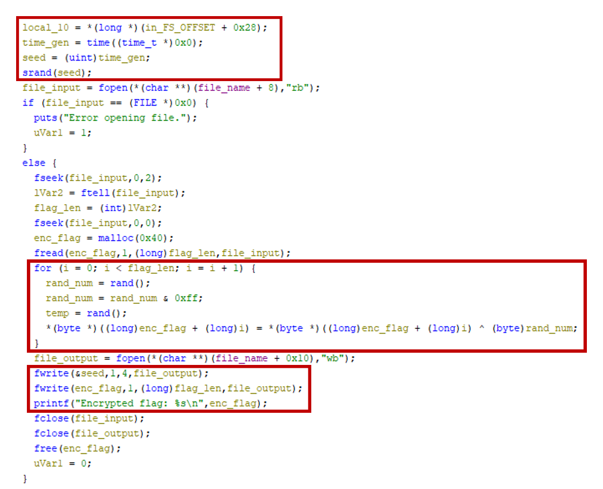

# [Rev] Random XOR

## 📚 Overview

> *"Hanya program simpel untuk enkripsi sebuah file."*

## ✨ Walkthrough

Given .ELF binary that is written in C language, the programme will **initialise the random number generator** using seed, which obtained using the time lib, **perform XOR operation** to obfuscate the content of a file, and then **overwrite the file**. For this challenge, we need to understand *how the random number generator works* before reversing the operation. 

In this case, let's use [Ghidra](https://ghidra-sre.org/) to analyse the binary and navigate to the `main` function.



For the **random number generator**, it isn't really *random* at all since it relies on a seed for initialisation. Whenever the `rand()` function is called, the generated number is already fixed.

After that, we could see that the programme use `rand()` function to generate random number for the XOR operation but it was called twice. This implies that the **first random number will be used, ignoring the second random number** and so on as the loop run *lol*.

Lastly, the programme will **write the seed inside a file**, then **followed by the encypted flag**. That said, we could reuse the seed to reverse the operation and decrypt the flag.

## ⚙ Solution

```c
#include <stdio.h>
#include <stdlib.h>

int main() {
    unsigned int time = 0x660C076D;
    srand(time);

    unsigned int enc_flag[] = {
        0xE9, 0x58, 0xD8, 0x09, 0x01, 0xAC, 0xCC, 0x6D, 0x53, 0x90, 0x7B, 0x58, 0xA6, 0x42,
        0xEC, 0xA5, 0xCF, 0x12, 0x5D, 0xCD, 0x8D, 0xBB, 0x4E, 0x97, 0x34, 0x11, 0xF8, 0x6F,
        0x41, 0x18, 0x7C, 0xC3, 0x2A, 0xE8, 0x1E, 0xAC, 0xED, 0x82, 0x30, 0x04, 0x27
    };
    int len_flag = sizeof(enc_flag) / sizeof(enc_flag[0]);

    for (int i = 0; i < len_flag; i++) {
        int key = rand() & 0xFF;
        int temp = rand();

        printf("%c", key ^ enc_flag[i]);
    }

    return 0;
}
```

## 🏳️ Flag

`TCP1P{p53uDO_RANDOM_IS_NOt_R4ndOM_at_A11}`